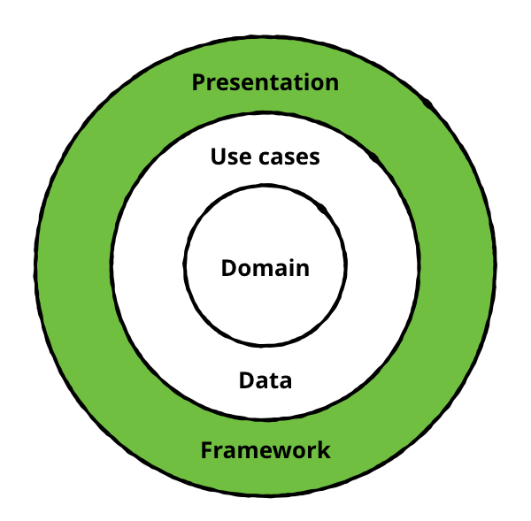

# stock
A stock market app to browse a list of active or delisted US stocks and ETFs, this project showcase clean architectural approache to developing Android apps. 

## Technologies 🖥

- User Interface built with Jetpack Compose
- A [single-activity](https://www.youtube.com/watch?v=2k8x8V77CrU) architecture, using Navigation Compose.
- A presentation layer that contains a Compose screen.
- Reactive UIs using Flow and coroutines for asynchronous operations.
- A data layer with a repository and two data sources (local using Room and a remote using Retrofit).
- Dependency injection using [Hilt](https://developer.android.com/training/dependency-injection/hilt-android).

## Features
- List of company listings using [alphavantage API](https://www.alphavantage.co/)
- Ability to search compan listings
- Offline caching 
- Show company details i.e. Graph (Custom Composable). See attached images

## Architecture
The Stock app follows the [official architecture guidance](https://developer.android.com/topic/architecture).
Clean architectire + Repository Pattern

## Language
Kotlin 
